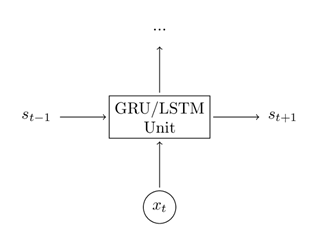
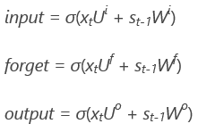
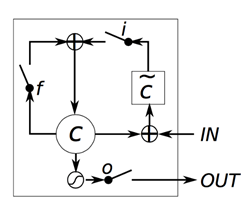
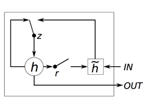

by William Darling

Almost all of the models that we're currently working on involve Recurrent Neural Networks (RNNs) and therefore Long Short Term Memory (LSTM) cells. The BrainScript core library that comes with CNTK has great support for working with LSTM-based networks thanks to Frank Seide's implementations. These allow us to quickly setup a powerful RNN model such as the query classification network described in my [previous](Recurrent Neural Networks with CNTK and applications to the world of ranking) post by simply calling the LSTM function: 

    L = BS.RNNs.RecurrentLSTMP(outputDim, cellDim=outputDim, sequence, inputDim=inputDim) 
    
However, while LSTMs are extremely useful and probably the most popular class of deep learning model currently in use (at least for NLP), the literature hasn't stood still since LSTMs were first introduced way back in 1997. A newer variant to the LSTM cell is the GRU: **G**ated **R**ecurrent **U**nit. A GRU is very similar to an LSTM cell but is actually a little simpler. It contains 2 gates instead of 3 (should be faster) and the output is exactly the same as the internal memory meaning that an additional nonlinearity applied to the output is not required (again should be faster). Because a GRU is less complex than a comparable LSTM cell, it may be able to generalize more easily but in turn won't be as expressive as an LSTM. 

GRUs were introduced just two years ago in 2014 and so they haven't been used nearly as much as LSTMs. The trade-offs and best practices therefore aren't understood as well as with an LSTM. [Sometimes](http://jmlr.org/proceedings/papers/v37/jozefowicz15.pdf) it's better to use a GRU, while other times it's better to use an LSTM. That being said, we of course want to try them out ourselves! Unfortunately, the BrainScript library doesn't contain a GRU implementation. But, since it's really just a simplified LSTM, I was able to implement one quite easily and add it to the BS library. Let's quickly look at the architectures of an LSTM cell and a GRU, go through how easy it is to implement in BS, and finally show some test results that I obtained by putting the two head-to-head when I dropped in the GRU as a replacement to the LSTM in the query classification problem I discussed last time. 

## LSTM vs GRU ##
I'd say that [this](http://colah.github.io/posts/2015-08-Understanding-LSTMs/) is the best resource for understanding how LSTMs work. Like last time, I will just give a high-level overview but it should include everything we need to understand the implementation. An LSTM is a unit that takes an element from a sequence as input along with the hidden state generated from an LSTM on the previous element as another input and produces some new hidden state. Same thing for a GRU. It looks something like this: 

[1]

What differentiates an LSTM unit and a GRU is how the unit calculates the hidden state output (obviously). LSTMs and GRUs use gates to control the flow of information. These gates are what help them to deal with the vanishing gradient problem that plagues vanilla RNNs. An LSTM has 3 gates: (1) the input; (2) the forget; and (3) the output gate. All these gates do is regulate how much of the information from the input is "let in" to the unit, how much is kept around / forgotten, and how much is output to the next state. The equations for each of these gates are as follows:

The sigma function squashes the information down to between 0 and 1 which shows how these are thought of as (real-valued) gates. Instead of allowing just no information or all of the information through, the network can learn just how much to let through, just how much to remember, and just how much to pass on. An LSTM unit has a "memory cell" that keeps around values for use next time. We will store some candidate values for the new contents of the cell by computing a tanh() (squashing values to be between -1 and 1) again on the input and the previous time-step's hidden state with again another set of weights. We then set up the new value of the cell by element-wise multiplying its old value with the forget gate value (which we calculated just above) added to the "candidate values" element-wise multiplied into our input gate (I use '.*' to mean element-wise multiplication): 

Finally, we apply another tanh() nonlinearity and apply the output gate using element-wise multiplication to create our new hidden state:

And that's it! Here is a somewhat complicated visualization of what the unit itself looks like: 

[2]

Now let's look at a GRU. It only has two gates: the "reset gate" r and the "update gate" z. Its output is the same as its memory cell so there's no distinction between c and s, and therefore no nonlinearity is applied when computing the output. Here is what it looks like: 

[3]

Easier, right? So, the calculations are pretty easy. First, we calculate the gate values: 

Then we get our candidate hidden-state values by applying the tanh() nonlinearity to the input and a somewhat-reset version of the previous state: 

And finally we compute the new value for the hidden state which is the weighted version of the candidate values due to the element-wise multiplication with the left-over percentage of the update gate added to the previous state's value weighted by the update gate: 

Simple!

## BS Implementation ##
The CNTK network description language [BrainScript](./BS-Basic-concepts) "provides a simple way to define a network in a code-like fashion, using expressions, variables, primitive and self-defined functions, nested blocks, and other well understood concepts". The full function reference can be found [here](./Full-Function-Reference) but for a full understanding it helps to look at the code. The entire BS library is contained within a single file in the CNTK source code at <CNTK>/Source/CNTK/BrainScript/CNTKCoreLib/CNTK.core.bs. If you've installed CNTK from the binaries (or if you built it yourself), the CNTK.core.bs file will be located next to the CNTK executable. 
For implementing RNNs, there is the LSTM unit defined under RNNs.LSTMP(), a recurrent LSTM "layer" defined under RNNs.RecurrentLSTMP() (which makes use of the LSTMP() function), and RNNs.RecurrentBidirectionalLSTMPStack() which is a convenience function to allow setting up stacked, bi-directional layers of LSTMs. As stated before, though, there is no way to use a GRU. So let's make one. We'll first setup the GRU itself. 

    # GRU -- GRU function 
    # It returns a dictionary with one member: h. 
    GRU (outputDim, cellDim=outputDim, x, inputDim=x.dim, prevState) = 
    [ 
       dh = prevState.h // previous value 
     
       // parameter macros 
       # note: each invocation comes with its own set of weights 
       B() = Parameters.BiasParam (cellDim) 
       W() = Parameters.WeightParam (cellDim, inputDim) // input 
       H() = Parameters.WeightParam (cellDim, outputDim) // hidden-to-hidden 
     
       # projected contribution from input(s) 
       pin() = B() + W() * x 
     
       # update gate z(t) 
       zt = Sigmoid (pin() + H() * dh) 
     
       # reset gate r(t) 
       rt = Sigmoid (pin() + H() * dh) 
     
       # "cell" c 
       rs = dh .* rt 
       c = Tanh (pin() + H() * rs) 
     
       # hidden state h(t) / output 
       h = (BS.Constants.OnesTensor (cellDim) - zt) .* c + zt .* dh 
    ] 

I've added the above within the RNNs namespace so now we can access it by simply calling RNNs.GRU(). Let's go through the implementation. First, we pass in the desired shape of the output (outputDim), the desired shape of the internal cell (cellDim – note that for now this must equal the outputDim because to keep things simple we don't implement projection. If we had implemented projection [where we project a smaller/bigger tensor to a bigger/smaller tensor] then we would have to include some code for that). We include the actual features to be passed in (x), the dimensionality/shape of the input (inputDim), and a pointer to the previous state object. 

First, we store the value of the previous state's hidden state which is accessible with the dot notation. You'll notice at the bottom of the function definition that the hidden state is stored in the variable h so we can access it by doing a prevState.h. To keep things clean, we might encapsulate the earlier variables inside an additional block so that they're in some sense "hidden" from being accessed, but for now it's just fine as is (though someone could if they wanted access the value of the reset gate by calling prevState.rt). We then set up a few macros to make parameter declaration easier. This is because there are so many weight matrices and biases used in an LSTM/GRU. We set up a bias macro with the shape of the cell, a weight matrix macro with a shape of (cellDim, inputDim), and another weight matrix macro with a shape of (cellDim, outputDim). The rest is straightforward; BS reads like math and so all I had to do was essentially copy out the equations that define a GRU and put them in my BS function. The one potentially tricky part is doing the (1 – z) calculation, but for that we can simply use the BS convenience function BS.Constants.OneTensor(cellDim) which sets up a tensor full of 1's in the same shape as cellDim.

Now all we need to do is make a small function that makes use of the GRU. Here's what it looks like: 

    # this implements a recurrent (stateful) GRU 
    RecurrentGRU (outputDim, x, inputDim=x.dim, previousHook=BS.RNNs.PreviousHC) = 
    [ 
       prevState = previousHook (gruState, layerIndex=0) 
       gruState = BS.RNNs.GRU (outputDim, x, inputDim=inputDim, prevState) 
    ].gruState // that's the value we return 

This is pretty easy and this is the macro we would call directly from our network definition (just like we called RecurrentLSTMP() from the sequence classification network in the previous post). We pass in the output size and the input and its size of course, but then we also pass in a function pointer called previousHook. In this case we pass in the BS macro BS.RNNs.PreviousHC. This returns the previous element in the sequence with respect to the element that we're currently looking at. By allowing this function to be passed in, we can easily turn the GRU into a right-to-left model by instead passing in BS.RNNs.NextHC which returns the next hidden state in the sequence. 

Then, there are just two steps: (1) we set up the previous state by calling the passed-in previousHook function (the layerIndex is for working with layered LSTMs/GRUs but we're not going that far right now); and (2) we set up the gruState to return by calling our developed-above GRU unit. This demonstrates one of the really cool things about BS. We use gruState in the previousHook function before we've defined what gruState is just below. This is not a problem because BS reasons over the network description and understands the recurrent connection. Just like that, we can replace our LSTM-based sequence classification with a GRU-based network like this: 

    L = BS.RNNs.RecurrentGRU(outputDim, x, inputDim=inputDim)

That's it!

## Take-aways ##
1. BrainScript is flexible and new model paradigms can easily be added either to your local network or, if they're general enough, to the CNTK core library for others to easily reuse; 
1. Using a GRU in place of an LSTM can make training slightly faster depending on your setup; and 
1. In this case the GRU version was able to lower the loss better than the LSTM (and in turn achieve a better training-set accuracy) and achieved a slightly better generalization on the test set. However, this is only one application! But at least in this case, it looks like the GRU is the right choice. 

[1,2,3] These 3 images are from [http://www.wildml.com/2015/10/recurrent-neural-network-tutorial-part-4-implementing-a-grulstm-rnn-with-python-and-theano/](http://www.wildml.com/2015/10/recurrent-neural-network-tutorial-part-4-implementing-a-grulstm-rnn-with-python-and-theano).