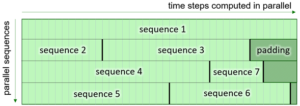

by William Darling

Today, I want to talk about three things that we've been working on recently: (1) recurrent neural networks (RNNs); (2) implementing common RNN paradigms in CNTK; and (3) one slightly detailed example of how we are using these networks to help the ranking team and other teams throughout Bing. I'll start with a brief overview of RNNs and the specific type of RNN – Long Short Term Memory (LSTM) – that we're using. Then I'll talk about how the different types of RNN/LSTM networks fit into areas that are of interest to Bing, where we are in our progress in one of the examples, and what challenges lay ahead. 

## Recurrent Neural Networks ##
There are excellent resources out there that provide deep technical details about RNNs and LSTMs including Andrej Karpathy's "[The Unreasonable Effectiveness of Recurrent Neural Networks](http://karpathy.github.io/2015/05/21/rnn-effectiveness/)" and Christopher Olah's "[Understanding LSTM Networks](https://colah.github.io/posts/2015-08-Understanding-LSTMs/)". Here I just want to provide a high-level overview. 

The most important distinction of RNNs from traditional neural networks is that they have loops. A traditional NN has a fixed architecture that can only take as input a tensor of some specific size (e.g. an image or a single word encoded as a one-hot-vector). An RNN, on the other hand, operates over sequences of tensors. Therefore, these networks open up a range of applications that allow for much more interesting inputs (and outputs) such as video (sequences of images); music (sequences of notes); and, of course, variable-length texts (e.g. queries, passages, titles, HTML bodies, etc.). In particular, a RNN can be visualized like this: 

[1]

Looking at the image above, it's obvious that this type of network is a natural fit for working with sequences. You can think of RNNs as the "Hidden Markov Models of deep learning" (more or less). Similar to HMMs, there is some hidden state that affects how some observation is emitted at each step, and that hidden state (and therefore the observation) affects what will be generated in the future. The [A] in the image above is some "layer" of a NN and therefore contains a bias, a weight matrix, and some activation function. While this works nicely in theory, long-term dependencies prove to be a big problem for vanilla RNNs because the gradient vanishes over the [long-term](http://www-dsi.ing.unifi.it/~paolo/ps/tnn-94-gradient.pdf). Fortunately, however, there is a slightly more complex way to model [A]: with an LSTM.

LSTMs can be somewhat complex (again, please see the tutorials linked to above) but the important concept underlying them and why they work so well to overcome long-term dependency problems is not. An LSTM contains a "memory cell" which allows different amounts of information to persist at each node. Importantly, the cell is "regulated" by a series of gates (which consist of a sigmoid NN layer and element-wise multiplication) that allow information to get through. There are three of these gates: (1) an input gate; (2) a forget gate (with a self-recurrent connection); and (3) an output gate. Thanks to the sigmoid layer at each gate, some portion [0, 1.0] of the information can be let in, stored, and let out.

[2]

Ok, that's about as technical as this post will get. Now that we have the machinery to implement RNN/LSTM-based NNs, let's talk about what we can do with them. 

## RNN Paradigms  ##
Andrej Karapathy nicely divides possible NN paradigms into 5 categories as shown below: 

[3]

The one-to-one paradigm is the traditional NN that takes a fixed-size input, does something in >=1 layers of NN-goodness (weight matrices and activation functions, etc.), and then outputs a fixed-size vector. A great example of this is the MNIST image classification that we showed in one of our original CNTK tutorial posts. One-to-many would take a fixed-size input and generate a variable-length output (e.g. image captioning). Many-to-one takes a variable-length sequence as input and outputs a fixed vector (e.g. sequence classification for classifying queries, movie reviews, etc.). Many-to-many (A) could be used for machine translation; and (B) for part-of-speech tagging.
 
On our team, we are currently concentrating on two examples of many-to-one, and one example of many-to-many networks. For the former we are looking at query classification and query-passage scoring, and for the latter we're looking at generating titles for URLs that a user might click on based on a query. In this post I will concentrate on query classification and in future posts we will cover the other more complex examples.  

In CNTK the complicated LSTM part is abstracted away. Note that before describing the features we setup a dynamic axis object. This is a special concept in CNTK that allows it to be more powerful for RNNs than other competing toolkits like Theano and TensorFlow. The standard approach to dealing with variable-length sequences before CNTK was to choose a maximum sequence length, stack up the sequences in a tensor, and pad the cells with a special character to allow for proper and efficient matrix multiplication. But this wastes a ton of computation on garbage data that is just thrown away. In CNTK, we simply state in BS that our data has a dynamic axis, and those sequences of different lengths are then automatically packed and padded where necessary, taking full advantage of the parallel nature of GPUs: 

[4]

- [1] Image thanks to [https://colah.github.io/posts/2015-08-Understanding-LSTMs/](https://colah.github.io/posts/2015-08-Understanding-LSTMs/). 
- [2] Image thanks to [http://deeplearning.net/tutorial/lstm.html](http://deeplearning.net/tutorial/lstm.html). 
- [3] Image thanks to [http://karpathy.github.io/2015/05/21/rnn-effectiveness/](http://karpathy.github.io/2015/05/21/rnn-effectiveness/). 
- [4] Image thanks to Frank Seide's presentation at [https://github.com/Microsoft/CNTK/wiki/ppt/LATAM_Frank_Seide_CNTK,%202016-5-19,%20Print.pptx](https://github.com/Microsoft/CNTK/wiki/ppt/LATAM_Frank_Seide_CNTK,%202016-5-19,%20Print.pptx).
