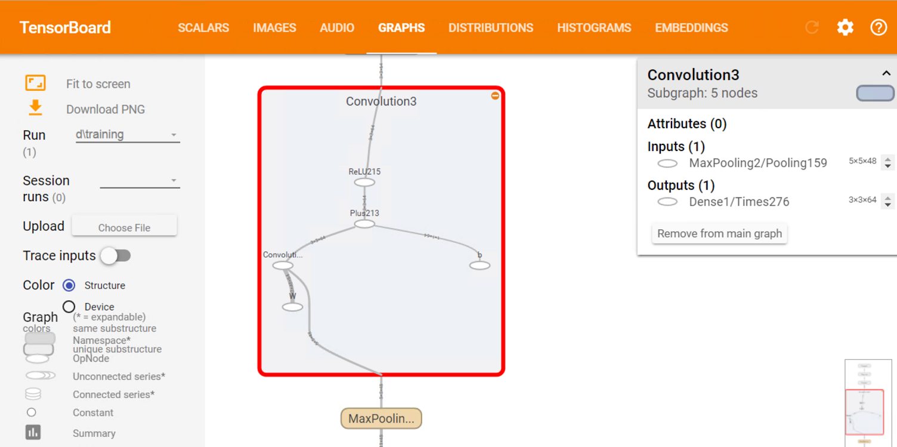
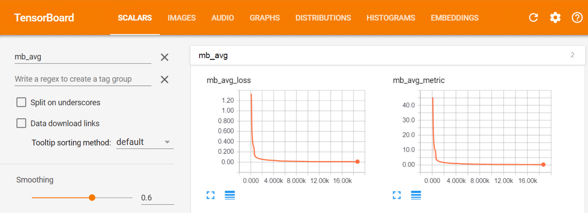

# Using TensorBoard for Visualization

[TensorBoard](https://github.com/tensorflow/tensorflow/blob/master/tensorflow/tensorboard/README.md) is a suite of visualization tools that makes it easier to understand and debug deep learning programs. For example, it allows viewing the model graph, plotting various scalar values as the training progresses, and visualizing the embeddings. 

## Python

[TensorBoardProgressWriter](https://www.cntk.ai/pythondocs/cntk.utils.html#cntk.utils.progress_print.TensorBoardProgressWriter) class in Python now supports output in the native TensorBoard format, thus enabling rich visualization capabilities for CNTK jobs. At present, TensorBoardProgressWriter can be used to:
* Record model graph.
* Record arbitrary scalar values during training.
* Automatically record the values of a loss function and error rate during training.





First, you need to instantiate a TensorBoardProgressWriter class by providing some of the following arguments:

* **freq** – how frequently to log to output files. E.g. the value of 2 will cause every second call to update method to write to disk.
* **log_dir** - a directory where the output files will be created.
* **rank** - in case of distributed training, this should be set to a rank of a worker. If set, TensorBoardProgressWriter makes sure that only progress from worker 0 is recorded.
* **model** – a CNTK model to visualize.

For example, the below line instantiates a TensorBoardProgressWriter that will create files in the ‘log’ directory and write to disk on every 10th call. It will also persist the my_model's graph for visualization later.

```python
tensorboard_writer = TensorBoardProgressWriter(freq=10, log_dir=’log’, model=my_model)
```

You then need to provide the above object to Trainer upon construction:

```python
trainer = Trainer(my_model, (ce, pe), learner, tensorboard_writer)
```

The Trainer object will make sure to update the TensorBoardProgressWriter with the values of loss/evaluation metric after training/testing on each minibatch. Therefore, you do not need to explicitly call TensorBoardProgressWriter to record these values. To record any other scalar values, you can use [write_value()](https://www.cntk.ai/pythondocs/cntk.utils.html#cntk.utils.progress_print.TensorBoardProgressWriter.write_value) method, e.g.: 

```python
    # Log mean of each parameter tensor, to confirm that the parameters change indeed.
    # Don't want to do that very often though, not to spend too much time computing the mean.
    if minibatch_idx % 10000 == 0:
        for p in my_model.parameters:
            tensorboard_writer.write_value(p.uid + "/mean",  reduce_mean(p).eval(), minibatch_idx)
```

TensorBoard is not part of CNTK package and should be installed separately. After the installation, once your training job is started, you can launch TensorBoard to monitor its progress by running the following command:

```shell
    tensorboard --logdir=log
```

(assuming the command is run from the script’s working directory) and navigate to <http://localhost:6006/> in your favorite web-browser.

The following scripts contain examples on how to use TensorBoardProgressWriter:

[Examples/Image/Classification/MLP/Python/SimpleMNIST.py](https://github.com/Microsoft/CNTK/blob/master/Examples/Image/Classification/MLP/Python/SimpleMNIST.py)<br/>
[Examples/Image/Classification/ResNet/Python/TrainResNet_CIFAR10.py](https://github.com/Microsoft/CNTK/blob/master/Examples/Image/Classification//ResNet/Python/TrainResNet_CIFAR10.py)<br/>
[Examples/Image/Classification/ConvNet/Python/ConvNet_CIFAR10_DataAug_Distributed.py](https://github.com/Microsoft/CNTK/blob/master/Examples/Image/Classification/ConvNet/Python/ConvNet_CIFAR10_DataAug_Distributed.py)<br/>
[Examples/LanguageUnderstanding/ATIS/Python/LanguageUnderstanding.py](https://github.com/Microsoft/CNTK/blob/master/Examples/LanguageUnderstanding/ATIS/Python/LanguageUnderstanding.py)

## BrainScript

You can also instruct CNTK to log the training progress and the model graph from BrainScript. The following two settings in SGD block control TensorBoard output:

* **tensorBoardLogDir** - directory where the TensorBoard event files should be created. By default, this value is empty, meaning no TensorBoard output.
* **tensorBoardNumMBsToLogResult** - the frequency at which intermediate (per-minibatch) loss/evaluation metric are logged to TensorBoard. This setting is only used when **tensorBoardLogDir** was non-empty. By default, it uses the same value as **numMBsToShowResult**. Setting it to 0 results in no intermediate output, only per-epoch stats. Setting it to any positive integer N results in the TensorBoard progress output for every N minibatches.

You will typically pass these settings when launching CNTK from command-line:

```shell
    CNTK.exe configFile=myConfig tensorBoardLogDir=log tensorBoardNumMBsToLogResult=10
```
